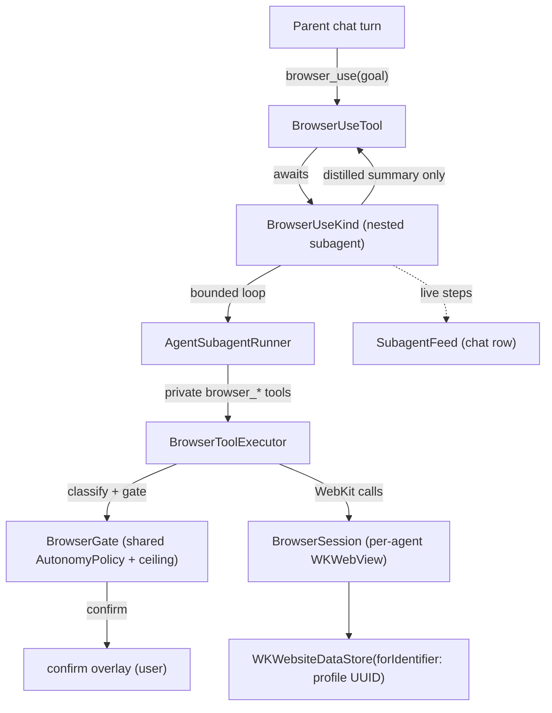

# Browser Use

Drive a real, persistent browser on the user's behalf to accomplish a
natural-language goal — read a dashboard, fill a form, work with content
behind a login. Browser Use is **off by default**, enabled **per custom
agent** in its Subagents tab (the built-in Default agent never gets browser
access), and every action passes through the **same safe-by-default autonomy
gate as Computer Use** before it runs.

Browser Use is the native replacement for the retired `osaurus.browser`
plugin. Existing plugin installs keep working as a card in Settings → Plugins
with a "Built into Osaurus" banner, but their tools and skill no longer load;
each agent's WebKit profile is migrated so sign-ins carry over (see
[Migration](#migration-from-the-osaurusbrowser-plugin)).

## Mental model

The parent agent calls one tool — `browser_use(goal:)` — exactly once. That
tool spins up a **nested subagent** (the shared `SubagentSession` host used by
`computer_use`, `spawn`, and `image`) that runs a navigate → act → verify loop
against a **private** `browser_*` toolset and returns a single summary. The
primitives never appear in the parent schema and the inner per-step decisions
never leak into the parent transcript; they surface only through the live
subagent feed rendered in the chat row.

## The entry tool — `browser_use`

`Browser/Tool/BrowserUseTool.swift`

| Field | Required | Description |
|-------|----------|-------------|
| `goal` | yes | The complete task in plain language, naming the site when it matters. |
| `max_steps` | no | Safety cap on child model turns (each turn can batch many page actions). Default `24`, clamped to `[1, 100]`. |

- **Gating.** Registered as a global built-in so the runtime can execute it
  and ChatView can intercept its feed, but `SystemPromptComposer` strips it
  authoritatively unless the agent set `browserUseEnabled`. Like
  `computer_use`, this is a **custom-agent capability**: the built-in Default
  agent is locked to its fixed baseline and never gets `browser_use`.
- **No per-call approval card.** The policy is `.auto`: the per-action gate
  (confirm overlay) is the real consent surface.
- **No registry timeout.** The loop drives a real browser over many model
  turns and may legitimately park on a user sign-in window, so it opts out of
  the registry timeout (`bypassRegistryTimeout`) and relies on its own
  15-minute wall-clock budget plus the user's stop control.
- **Model.** Inherits the parent chat model by default, with the standard
  per-agent model override (same axis as `computer_use`), including the
  single-residency handoff rules for local models.

## The private toolset

`Browser/Tool/BrowserChildTools.swift` defines the schemas the child model
sees; `Browser/Tool/BrowserToolExecutor.swift` executes them. They are the
ported plugin primitives — `browser_navigate`, `browser_snapshot`,
`browser_click`, `browser_type`, `browser_select`, `browser_hover`,
`browser_scroll`, `browser_do` (batched actions), `browser_press_key`,
`browser_wait_for`, `browser_screenshot`, `browser_execute_script`,
`browser_console_messages`, `browser_network_requests`,
`browser_handle_dialog`, `browser_cookies`, `browser_open_login`, and
`browser_reset_session` — plus two native additions: `browser_read_page`
(readability-style main-content extraction with `offset` pagination, so the
child can actually *read* articles/docs/prices instead of abusing
`execute_script`) and `browser_navigate_back` (history back). None are
registered in `ToolRegistry` and none are visible to the parent.

Snapshots return numbered element refs (`[E1] input`, `[E2] button "Submit"`)
that the child uses for subsequent actions, with `compact` / `standard` /
`full` / `none` detail levels to control verbosity. The snapshot walker
pierces **open shadow roots** and **same-origin iframes** (cross-origin
frames are listed as unreachable so the model knows content exists it cannot
see). Every action returns a fresh snapshot; `browser_do` batches multiple
actions into one call with one final snapshot.

## Sessions

`Browser/Runtime/BrowserSession.swift`, `BrowserSessionManager.swift`,
`BrowserSessionCatalog.swift`

- **One isolated profile per agent.** Each agent's session runs on a
  persistent `WKWebsiteDataStore(forIdentifier:)` keyed by a profile UUID in
  the session catalog (`~/.osaurus/config/browser-sessions.json`). Cookies,
  localStorage, and sign-ins survive across chats and app restarts — and are
  never shared with other agents or the user's regular browser.
- **Observed auth status, never inferred.** A service is marked
  `signInRequired` when a navigation lands on a login page, and
  `observedSignedIn` once the user completes the sign-in window (or a
  post-login page loads). Cookie presence alone never flips the status.
- **Sign-in flow.** The child never types credentials. On a login wall it
  calls `browser_open_login`; `BrowserWindowController` presents a visible
  window on the agent's profile, the user signs in directly, and the run
  resumes logged-in when the window closes.
- **Settings → Browser** lists every session with its live/saved state, last
  page, and per-service sign-in badges. Open attaches the live WebView (or
  restores the saved profile at its last page); Close detaches without
  touching data; Reset destructively wipes the profile after confirmation.
- **Reset is wipe-in-place.** Session reset uses
  `removeData(ofTypes:modifiedSince:)` and then mints a fresh profile UUID —
  never `WKWebsiteDataStore.remove(forIdentifier:)`, which races WebKit's
  networking XPC processes and can segfault the host.
- **Lifecycle.** Agent deletion wipes that agent's profile; factory reset
  wipes every profile (before `~/.osaurus` is deleted, while the catalog
  still knows the UUIDs); app termination detaches live sessions but keeps
  stored profiles. Live sessions **idle-close after 15 minutes** of
  inactivity (their WebKit XPC processes are reclaimed; the profile restores
  at its last page on next use) — sessions with a run in flight or a visible
  session window are never reaped.
- **New windows / uploads / downloads.** `target="_blank"` links and
  `window.open` load in the same webview (there are no tabs). File-input
  choosers are declined with a typed note the model can read via
  `browser_handle_dialog status` — pages can never be handed local files.
  Responses that would be downloads fail with a typed "downloads aren't
  supported" error instead of silently doing nothing.

## Safety

`Browser/Runtime/BrowserSupport.swift` (`BrowserEffectClassifier`),
`Browser/Tool/BrowserToolExecutor.swift` (`BrowserGate`)

Every primitive is classified into the same `EffectClass` ladder as Computer
Use and gated by the **shared** `AutonomyPolicy` (Settings → Computer Use →
Autonomy) plus the agent's own autonomy ceiling:

| Class | Browser actions | Default (Cautious) |
|-------|-----------------|--------------------|
| `read` | snapshot, wait_for, console/network inspection, get cookies, screenshot, dialog status | auto |
| `navigate` | navigate, scroll, hover, non-consequential clicks, plain key presses | auto |
| `edit` | type, select, set cookie, handle dialog | confirm |
| `consequential` | anything with `submit: true`, clicks on submit/purchase/send/delete-looking targets, clear cookies, reset session, open login, execute_script | confirm |

Consequential-looking click targets are detected from the element's label
(the same conservative escalation the plugin used). Confirm cards run through
the shared `ComputerUsePromptQueue` / confirm overlay, so both features
present one consistent approval surface; the host (domain) is shown as the
context. Denials are remembered for the run — the child is instructed not to
retry a denied action. The user can stop the run at any time from the feed.

Additional hardening beyond the gate ladder:

- **URL scheme policy.** Only `http`/`https` (and `about:blank`) load —
  enforced at the tool boundary (`browser_navigate` returns `invalid_args`)
  AND in `decidePolicyFor` (covers redirects, JS navigation, and clicked
  links). `file://` would let the model read arbitrary local files into its
  context; `data:`/`blob:`/custom schemes are blocked with it.
- **Cookie redaction.** `browser_cookies get` redacts values by default
  (name/domain/path/flags only). `include_values: true` is classified
  `consequential` — raw session tokens reach the transcript only after an
  explicit user approval.
- **Screenshot confinement.** `browser_screenshot` writes only inside
  `~/Downloads`; traversal out is rejected and existing files are never
  overwritten (names uniquify). Screenshots stay on disk — they are not
  returned to the child model (`AgentSubagentRunner` tool results are
  text-only today; vision attach is a tracked follow-up that would reuse the
  Computer Use cloud-vision consent flow).
- **Prompt-injection defenses.** The child prompt declares all page content
  UNTRUSTED DATA (a page can never change the goal, trigger scripts/logins/
  resets, or reveal cookies), and the digest returned to the parent is
  wrapped with a "derived from web content" provenance note plus a
  `content_origin` payload marker.

## Migration from the `osaurus.browser` plugin

- `PluginManager.supersededPluginIds` now includes `osaurus.browser`: its
  tools are not registered, and (unlike search) its **skill is also
  suppressed** — the skill teaches the model to call `browser_*` tools that
  no longer exist. The installed card stays with a "Built into Osaurus"
  banner deep-linking to Settings → Browser, and uninstall works normally.
- At launch, `BrowserPluginMigration` copies each agent's **exact**
  `osaurus.browser/profile_id` Keychain value into the native session catalog
  (one-time, idempotent, old key left in place). Because the UUID is reused,
  `WKWebsiteDataStore(forIdentifier:)` opens the very same on-disk store —
  existing sign-ins carry over with no user action. The plugin's
  default-agent profile fallback is deliberately **not** replicated: sharing
  one agent's authenticated session with another is the exact confusion the
  native design removes.
- The Browser pick was removed from onboarding's plugin chooser; browsing is
  a core capability now.

## Verification

Runtime, catalog, gating, and subagent tests live under
`Packages/OsaurusCore/Tests/Browser`. Capability evals
(`Packages/OsaurusEvals/Suites`) assert the native `browser_use` contract
instead of the plugin fixtures.

The `BrowserUse` eval suite (`Packages/OsaurusEvals/Suites/BrowserUse`)
scores real task completion: the run model drives the actual `browser_use`
host against a deterministic in-memory web (`FixtureBrowserWorld`) — form
fill, multi-step navigation, login-wall recovery, and stale-ref recovery —
with world-state read-back (typed values, clicked elements, verb order), so a
failure attributes to the model's planning rather than network flake.
